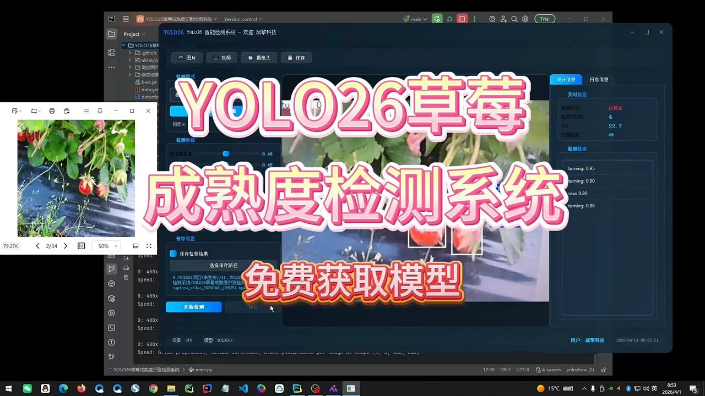
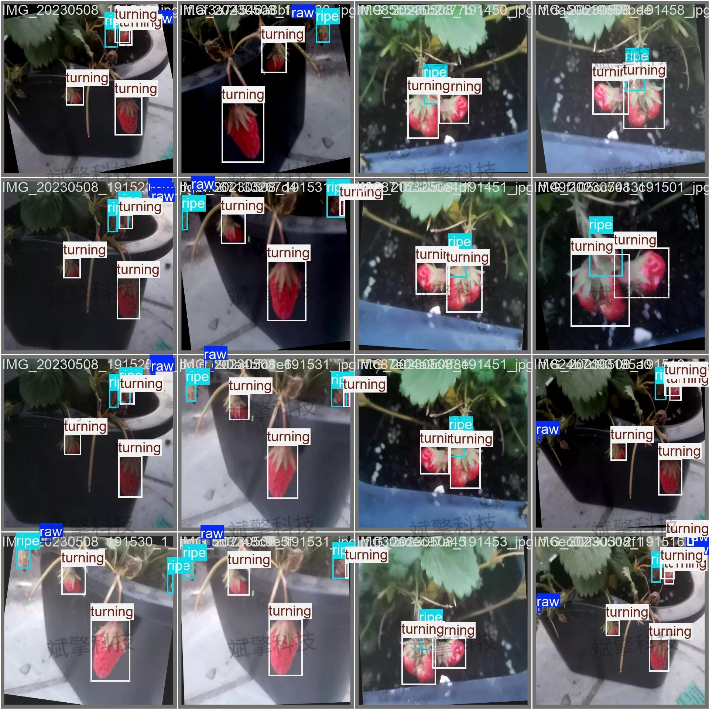
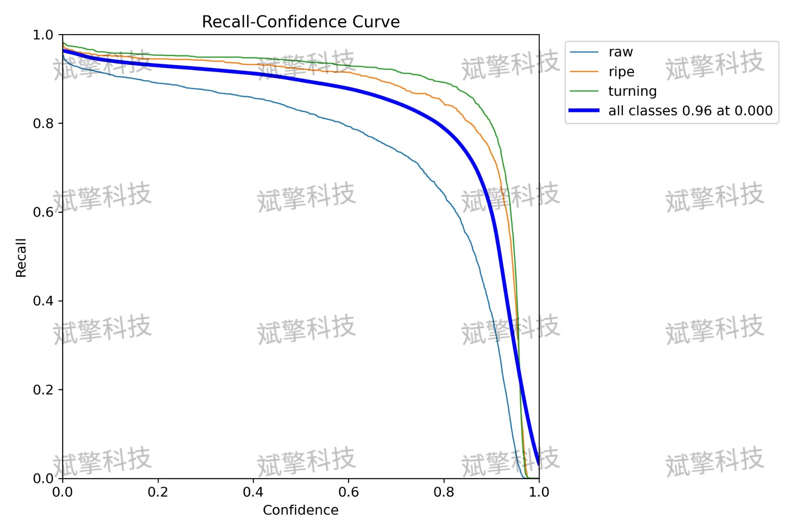
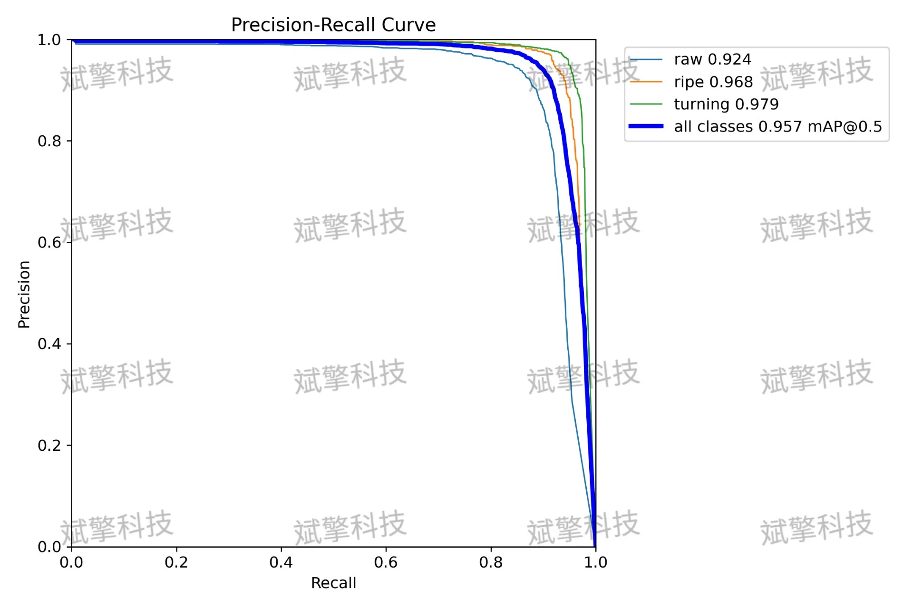
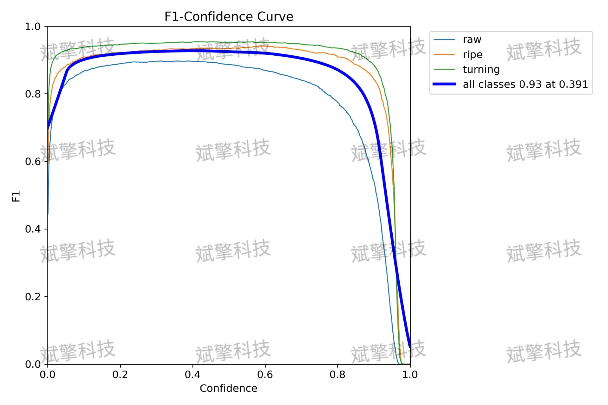
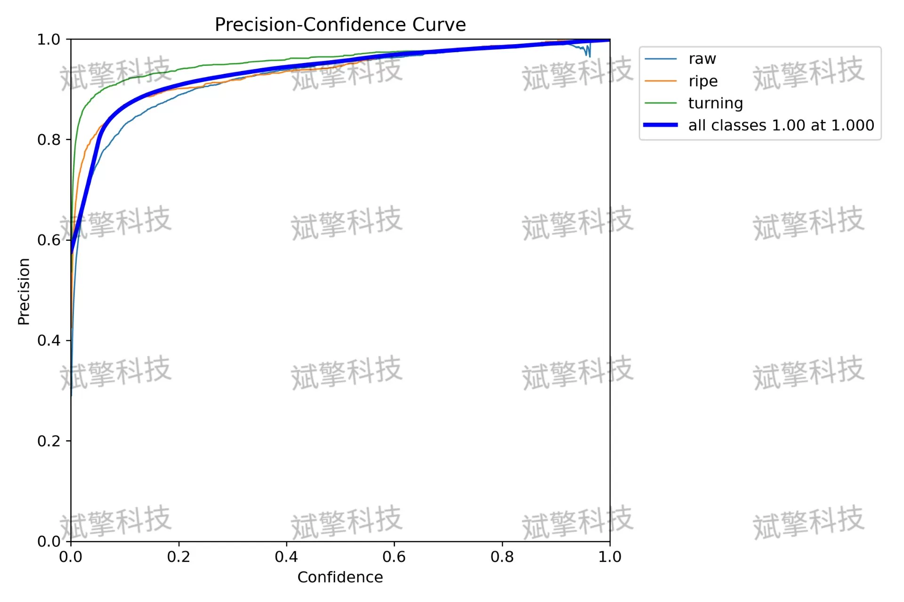
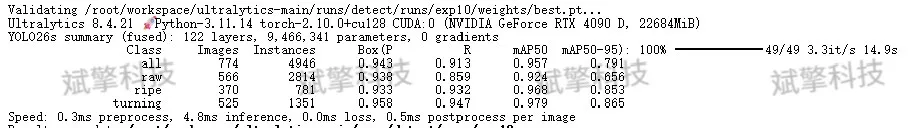
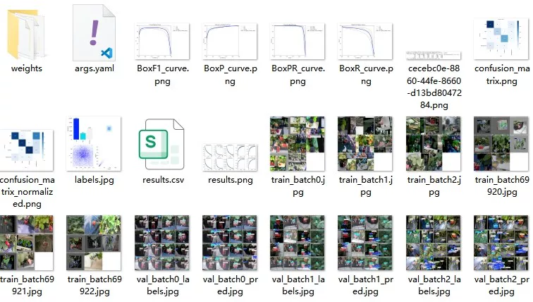
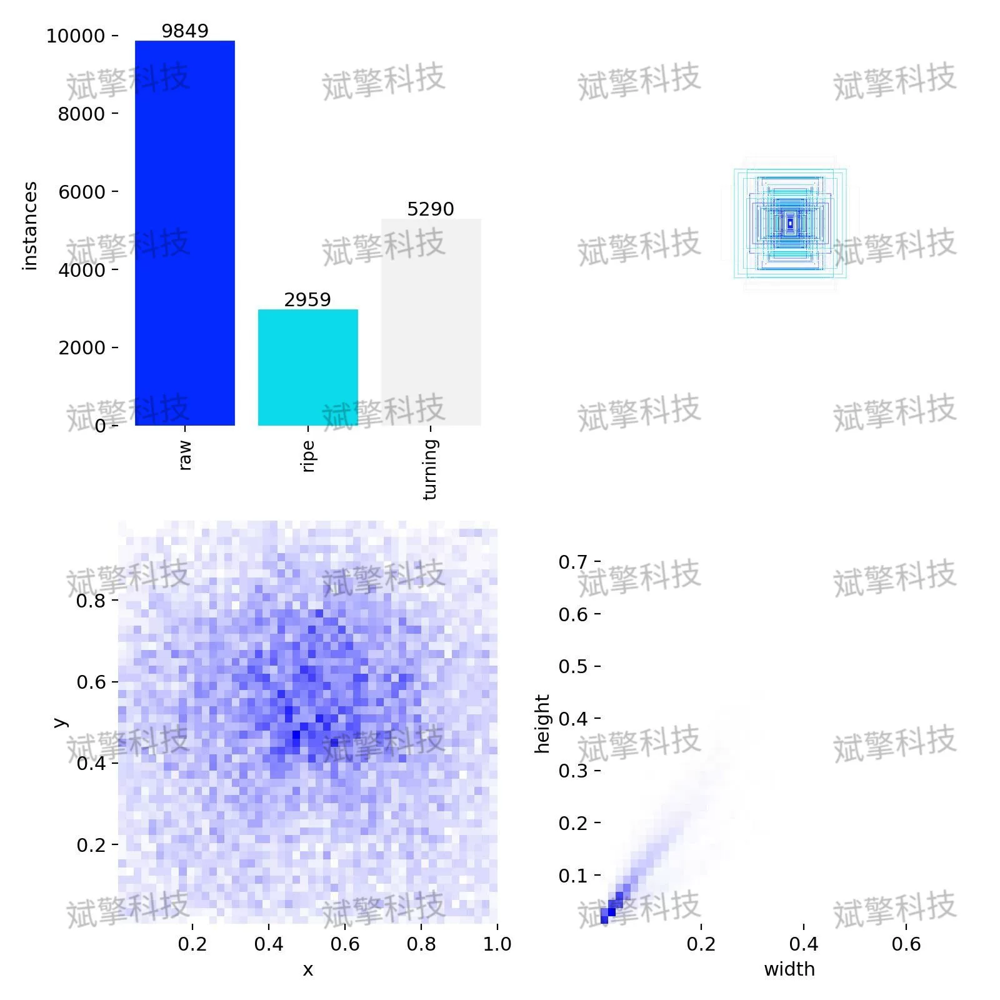

# YOLOv26 strawberry maturity detection system | source code

## Body

YOLO26 Strawberry Maturity Detection System | Source Code with 95.7% Accuracy! YOLO26 accurately determines whether strawberries are green, ripe, or in the changing color stage for maturity detection system.

This study proposes a deep learning target detection system based on the YOLO26 (You Only Look Once) architecture, aiming to achieve automated and high-precision identification of strawberry maturity. The system categorizes strawberries into three stages: vegetative stage (raw), ripe stage (ripe), and turning stage (turning). The experimental dataset consists of 2939 training images and 774 validation images. After thorough training, the model achieved excellent performance metrics on the validation set, with mailto:mAP@0.5 reaching 95.7%, and mailto:mAP@0.5:0.95 achieving 85.1%. A confusion matrix analysis indicates that the model is most accurate in identifying "turning" strawberries (mAP 0.979), while there are minor misclassifications of "vegetative" strawberries as background. This system can efficiently and accurately complete the classification task of strawberry maturity, possessing great potential for application in intelligent agricultural picking robots and automated sorting production lines.

Category Definition: The dataset contains three target detection categories, specifically defined as follows:
Raw: Represents unripe green strawberries.
Ripe: Represents fully ripe red strawberries.
Turning: Represents strawberries in the turning stage (partially red and partially green).
Data Division: To ensure the effectiveness of model training and the fairness of validation, the dataset is divided into a training set and a validation set.
Training Set: Containing 2939 images, used for learning model parameters and updating weights.
Validation Set: Containing 774 images, used to monitor the model performance during training, prevent overfitting, and evaluate the generalization ability of the final model after training.

Free remote installation appointments. Unsuccessful, full refund.
Purchase includes the following resources (auto-unlocked by Baidu Pan)
YOLO recognition detection project complete source code
YOLO format dataset
Training code + UI interface code
Trained model + result images
Software installer
Add WeChat to make a remote installation appointment (shown automatically after purchase) —— Unsuccessful, full refund

⚙️ Core Function Modules
Detection Capabilities
    Image Detection: Upon upload, returns detection boxes + category information.
    Video Detection: Supports video files, analyzes frames accurately in real-time.
    Camera Real-Time Detection: Attaches USB cameras to achieve dynamic monitoring.

️ Interaction and Control
    Target Filtering: Choose one or more categories for detection freely.
    Parameter Real-Time Adjustment: Adjustable confidence threshold & IoU threshold, flexibly control accuracy.
    Result Save: One-click save of image/video/camera detection results.

System and Data
    User Login and Registration: Supports password strength checking + encrypted storage.
    Logging: Automated recording of operation and error information (timestamped).

## Images

## Payment

Here is a pay link on Stripe ( https://buy.stripe.com/3cs8yP7sY87d0vu9AB ). Please contact me lonlonago@foxmail.com after funding $89, and I will send you a complete data files , thank you!

